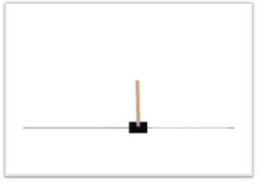

# CartPole-v1
A pole is attached by an un-actuated joint to a cart, which moves along a frictionless track. The system is controlled by applying a force of +1 or -1 to the cart. The pendulum starts upright, and the goal is to prevent it from falling over. 

  

  
## Environment
### State:
- observation space: Box(4,) 

### Action:
- action space: Discrete(2)
  - `0` move to the left
  - `1` move to the right

### Reward:
A reward of +1 is provided for every timestep that the pole remains upright.

### Game Over:
The episode ends when the pole is more than 15 degrees from vertical, or the cart moves more than 2.4 units from the center.

### Solve the Game:
The agents needs to receive an average reward of 195.0 over 100 consecutive episodes

## Installation
- pip install gym
- pip install numpy
- pip install tensorflow
- pip install keras

## The CODE
- We will solve this problem using Deep Reinforcement Learning
- Algorithm: Q Learning / Value Based Method
- Deep Neural Netork: Keras
